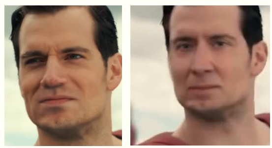

# Deepfake-Detection-MI4
The following repository is a project from the course of Machine Learning at the National Tsing Hua University. The main implementation is done by using two well-known CNNs, Meso4 and its Advanced part MesoInception4.

## Motivations: 
Due to the advances in technology, especially deep learning, which is capable of learning complex features, people can create images or videos that are difficult to distinguish its authenticity, and one of the powerful tools is deepfake with the ability of performing face-swapping. Therefore, it is imperative a structure capable to separate reality from what is fake. See below an image of Henry Cavill, on the left, and a Deepfake of the same image frame replaced with the face of Nicholas Cage, on the right.

## Dataset:
### No Augmentation

|  | Deepfake | Real |
|----------|----------|----------|
| Training (c23)  | 5104 | 7251 |
| Validation (c23) | 2846 | 4260 |
| Testing (c23) | 2790 | 2775 |
| Testing (c40) | 1800 | 1800 |

### With Augmentation

|  | Deepfake | Real |
|----------|----------|----------|
| Training (c23)  | 14648 | 15504 |
| Validation (c23) | 2846 | 4260 |
| Testing (c23) | 2790 | 2775 |
| Testing (c40) | 1800 | 1800 |

[Data Set without augmentation Download link](https://e.pcloud.link/publink/show?code=XZnsxkZkEAgI1OgQIJHLnNl9ErhV4vpHuV0)

## Requirements:
1. Python > 3.5
2. Numpy
3. Keras
4. Matplotlib
5. PIL

